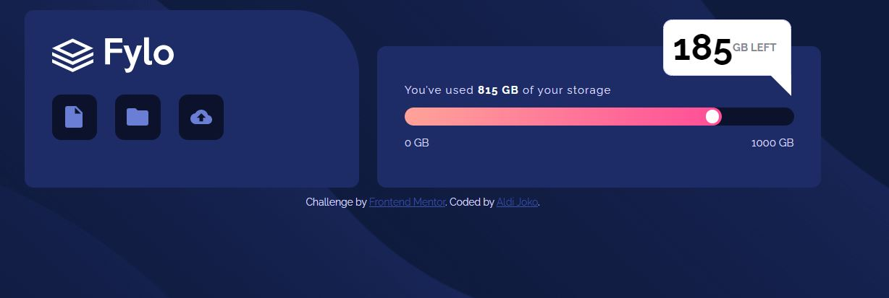

# Frontend Mentor - Fylo data storage component solution

This is a solution to the [Fylo data storage component challenge on Frontend Mentor](https://www.frontendmentor.io/challenges/fylo-data-storage-component-1dZPRbV5n). Frontend Mentor challenges help you improve your coding skills by building realistic projects. 

## Table of contents

- [Overview](#overview)
  - [The challenge](#the-challenge)
  - [Screenshot](#screenshot)
  - [Links](#links)
- [My process](#my-process)
  - [Built with](#built-with)
  - [What I learned](#what-i-learned)
  - [Useful resources](#useful-resources)
- [Author](#author)


## Overview

### The challenge

Users should be able to:

- View the optimal layout for the site depending on their device's screen size

### Screenshot



Add a screenshot of your solution. The easiest way to do this is to use Firefox to view your project, right-click the page and select "Take a Screenshot". You can choose either a full-height screenshot or a cropped one based on how long the page is. If it's very long, it might be best to crop it.

Alternatively, you can use a tool like [FireShot](https://getfireshot.com/) to take the screenshot. FireShot has a free option, so you don't need to purchase it. 

Then crop/optimize/edit your image however you like, add it to your project, and update the file path in the image above.

### Links

- Solution URL: [Github](https://github.com/aldijoko/fylo-data-storage)
- Live Site URL: [Live Url](https://aldijoko.github.io/fylo-data-storage/)

## My process

### Built with

- Semantic HTML5 markup
- CSS custom properties
- Flexbox

### What I learned

Use this section to recap over some of your major learnings while working through this project. Writing these out and providing code samples of areas you want to highlight is a great way to reinforce your own knowledge.

To see how you can add code snippets, see below:

```css
.tooltip {
    visibility: hidden;
    position: absolute;
    display: flex;
    align-items: center;
    top: -100px;
    right: -80px;
    border: 1px solid var(--paleBlue);
    width: 120px;
    height: 40px;
    padding: 10px;
    border-radius: 10px;
    background-color: white;
    border-bottom-right-radius: 0px;
    cursor: pointer;
}

.tooltip::after {
    content: "";
  position: absolute;
  top: 100%;
  right: -1px;
  /* margin-right: 5px; */
  border-width: 12px;
  border-style: solid;
  border-color: white white transparent transparent;
}

.circle:hover .tooltip {
    visibility: visible;
}
```


### Useful resources

- [Tooltip Css](https://www.w3schools.com/css/css_tooltip.asp) - This helped me for create tooltip when cursor on circle
- [Bar CSS](https://www.w3schools.com/howto/howto_css_skill_bar.asp) - This helped me for create bar progress bar.

## Author

- Frontend Mentor - [@aldijoko](https://www.frontendmentor.io/profile/aldijoko)
- Twitter - [@aldijokosp](https://www.twitter.com/aldijokosp)